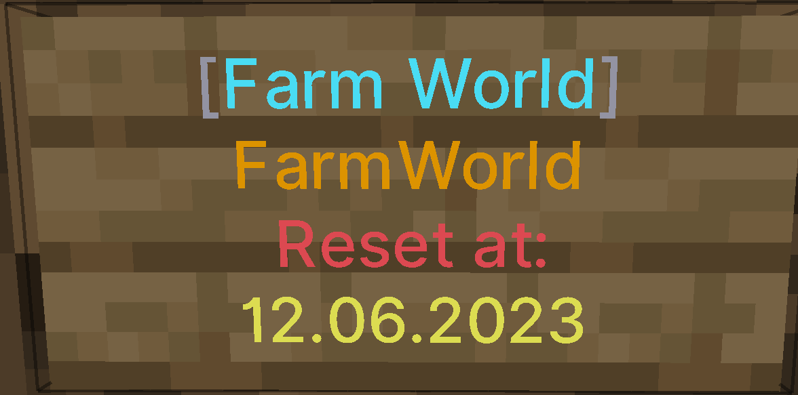

# FarmingWorld
FarmingWorld is a world management plugin for Spigot based servers to manage simplified farm worlds. <br>
You can create and manage multiple farm worlds that will be automatically deleted and create a new world.

---

The v2 is currently under development. <br>
The new version will include more features, performance improvements and more. <br>
Wishes or other suggestions for improvement can be submitted at any time. <br> <br>
You can find the v1 [here](https://github.com/SrSyntaxAT/FarmingWorld/tree/main).

---

## Contents

- [Configuration](#configuration)
- [Permissions](#permissions)
- [Sign](#sign)
- [Useful links](#useful-links)
- [License](#license)

---

## Configuration

#### messageType
The position at which the message is to be sent.
<br> CHAT - The message will be sent to the chat normally.
<br> SYSTEM - The message is sent as a system message in the chat and is displayed even if the player has only system messages enabled in the game settings.
<br> ACTION_BAR - The message is displayed above the health and armor bar.

```
"version": "2.0",                       # This value should not be changed.
"refund": 1.0,                          # What percentage the user will be refunded 
                                        # if they purchase a teleport to a farm world, 
                                        # but it is cancelled due to movement or other 
                                        # reasons. 0 = 0% 1.0 = 100%
"countdown": {                             
  "time": 5,                            # How long the teleport countdown runs in seconds. 0 = no countdown
  "permittedDistance": 0.7,             # How many blocks the player may move before the countdown is canceled.
  "movementAllowed": false,             # Allow a player to move during the countdown.
  "messageType": "ACTION_BAR"           # Where to display the message. CHAT, SYSTEM, ACTION_BAR
},
"defaultFarmWorld": "FarmWorld",        # The default farm world, which can be reached with /farming.
"farmWorlds": [                         # A list of all farm worlds.
  {                          
    "name": "FarmWorld",                # Farm world name
    "cooldown": 1800,                   # How long the player has to wait in seconds before being allowed to teleport again. 
    "timer": 43200,                     # The time in minutes until the farm world is reset.
    "environment": "NORMAL",            # World type with which the farm world should be created.
    "border": {                         
      "size": 10000,                    
      "centerX": 0,                     
      "centerZ": 0                      
    },                          
    "active": false,                    # Whether the world is enabled and players can teleport to it.
    "aliases": [                        # Aliases are commands with which players can teleport to the farm world.
      "FarmWorld"                       
    ]
  }
],
"blacklist": ["AIR", "LAVA", "WATER"],  # On which blocks can not be teleported.
"sign": {                               # 
  "daysFormat": "dd.MM.yyyy",           # With what pattern to be used for the signs.
  "hoursFormat": "HH:mm",               # https://www.digitalocean.com/community/tutorials/java-simpledateformat-java-date-format#patterns
  "linesWhenActive": [                  # The lines of the sign when the farm world is active.
    "&7[&bFarm World&7]",               # Placeholder: %{farm_world} = farm world name
    "&6%{farm_world}",                  # %{players}    = Players who are on the farm world.
    "&cReset at:",                      # %{date}       = Reset date
    "&e%{date}"                         # %{remaining}  = Remaining time until reset
  ],
  "linesWhenInactive": [                # The lines of the sign when the farm world is inactive.
    "&7[&bFarm World&7]",               # Placeholder: %{farm_world} = farm world name
    "&6%{farm_world}",                  # %{players}    = Players who are on the farm world.
    "&4&lDISABLED"                      
  ]
},
"locationCache": 3,                     # How many teleport locations to pre-generate.
"spawnCommandEnabled": true,            # Whether you can use the /spawn command.
"spawnType": "FIRST",                   # Types whether the player should be teleported to the spawn when joining.
                                        # FORCE = at every join | FIRTST = at the first join | NONE = will never be teleported
"resetDisplay": {                       # Displayed in the farm world when it is reset.
  "enabled": true,                      # Whether to display the message.
  "type": "BOSS_BAR",                   # Where to display the message. ACTION_BAR & BOSS_BAR
  "barStyle": "SEGMENTED_20",           # At a boss bar how full the progress should be.
                                        # https://hub.spigotmc.org/javadocs/spigot/org/bukkit/boss/BarStyle.html
  "barColor": "BLUE",                   # What color is the boss bar.
                                        # https://hub.spigotmc.org/javadocs/spigot/org/bukkit/boss/BarColor.html
  "changeBossBarProgress": true,        # Whether to match progress with time remaining to reset.
  "message": "&cReset:&e %{date}",      # The message to be displayed.
                                        # Placeholder: %{date} & %{remaining}
  "dateFormat": "HH:mm:ss dd.MM.yyyy"   # Which pattern should be used for the date.
},                                      # https://www.digitalocean.com/community/tutorials/java-simpledateformat-java-date-format#patterns
"spawn": {                              # The fallback or spawn location.
  "world": "world",
  "x": 0.0,
  "y": 78.0,
  "z": 0.0,
  "pitch": 0.0,
  "yaw": 0.0
}
```
---

## Permissions

| Permission                     | Description                                                                                        |
|--------------------------------|----------------------------------------------------------------------------------------------------|
| farmingworld.admin             | Gives the player permission for the /fwa command.                                                  |
| farmingworld.world.*           | Allow the player to teleport in all farm worlds.                                                   |
| farmingworld.world.{farmworld} | Allows a player to teleport to the farm world if the farm world has a restriction.                 |
| farmingworld.teleport.other    | Allow a player to teleport another player with /farming <player> or /farming <farmworld> <player>. |
| farmingworld.sign              | Is needed to be able to create a sign.                                                             |

---

## Sign

You can create signs so that players are teleported to the farm world when they click on the sign.
To be allowed to create a sign you need the permission farmingworld.sign or farmingworld.admin.




If you don't want to have the sign anymore, you can simply destroy it in Creative Mode.

---

## Useful links

* [Download](https://www.spigotmc.org/resources/farmingworld.100640/)
* [Discord](http://discord.gg/tvEFd4j)
* [Issues](https://github.com/SrSyntaxAT/FarmingWorld/issues)

---

## License
This project is licensed under the **MIT License**. Read more in the LICENSE file.
